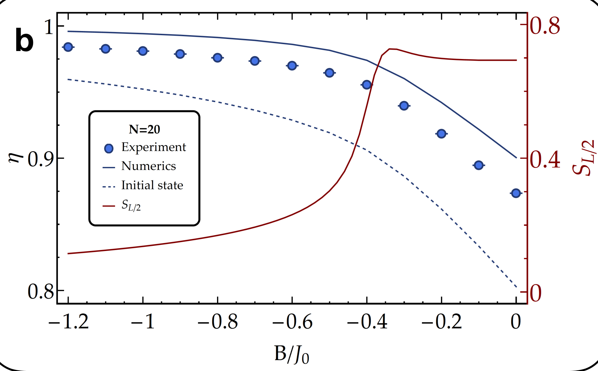
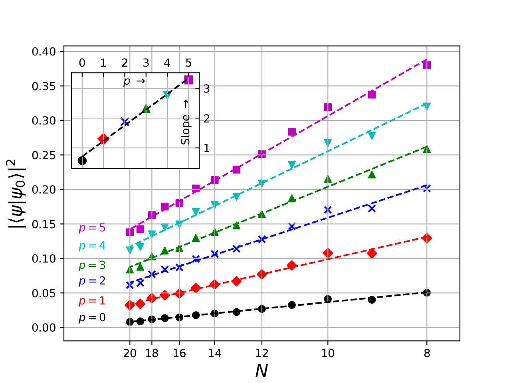

---

##### Download

- [Paper](/papers/trappedionqaoa/paper.pdf)

---

##### Abstract

Quantum computers and simulators may offer significant advantages over their classical counterparts, providing insights into quantum many-body systems and possibly improving performance for solving exponentially hard problems, such as optimization and satisfiability. Here, we report the implementation of a low-depth Quantum Approximate Optimization Algorithm (QAOA) using an analog quantum simulator. We estimate the ground-state energy of the Transverse Field Ising Model with long-range interactions with tunable range, and we optimize the corresponding combinatorial classical problem by sampling the QAOA output with high-fidelity, single-shot, individual qubit measurements. We execute the algorithm with both an exhaustive search and closed-loop optimization of the variational parameters, approximating the ground-state energy with up to 40 trapped-ion qubits. We benchmark the experiment with bootstrapping heuristic methods scaling polynomially with the system size. We observe, in agreement with numerics, that the QAOA performance does not degrade significantly as we scale up the system size and that the runtime is approximately independent from the number of qubits. We finally give a comprehensive analysis of the errors occurring in our system, a crucial step in the path forward toward the application of the QAOA to more general problem instances.

---

##### Figures



---

##### Citation

Pagano, G., Bapat, A., Becker, P., Collins, K. S., De, A., Hess, P. W., ... & Monroe, C. (2020). "Quantum approximate optimization of the long-range Ising model with a trapped-ion quantum simulator". *Proceedings of the National Academy of Sciences, 117(41), 25396-25401*.

```BibTeX
  @article{pagano2020quantum,
  title={Quantum approximate optimization of the long-range Ising model with a trapped-ion quantum simulator},
  author={Pagano, Guido and Bapat, Aniruddha and Becker, Patrick and Collins, Katherine S and De, Arinjoy and Hess, Paul W and Kaplan, Harvey B and Kyprianidis, Antonis and Tan, Wen Lin and Baldwin, Christopher and others},
  journal={Proceedings of the National Academy of Sciences},
  volume={117},
  number={41},
  pages={25396--25401},
  year={2020},
  publisher={National Acad Sciences}
}
```

---

##### Related material

+ [Poster](/papers/trappedionqaoa/poster.pdf)